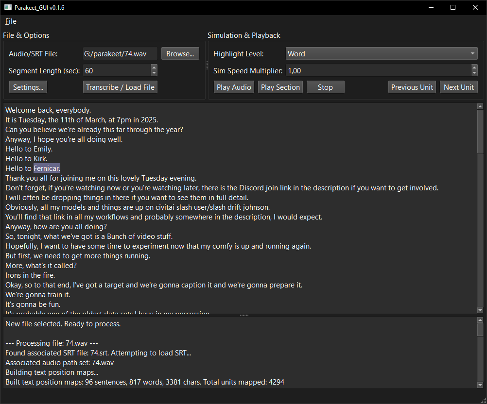
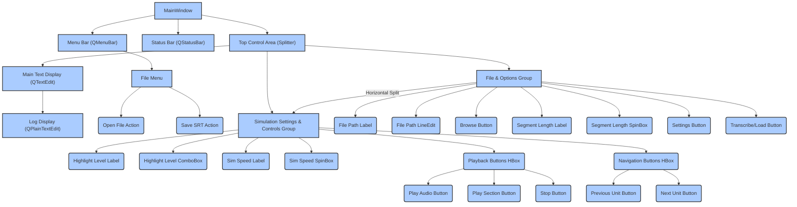

# Parakeet_GUI


https://github.com/user-attachments/assets/b53756dd-3811-409e-8aea-904228d8656e

## Description

Parakeet_GUI is a desktop application built using the TINS paradigm for transcribing audio files into timed text. It leverages NVIDIA's high-quality Parakeet Automatic Speech Recognition (ASR) model ([`nvidia/parakeet-tdt-0.6b-v2`](https://huggingface.co/nvidia/parakeet-tdt-0.6b-v2)), which requires a CUDA-enabled GPU for performance.

The application provides a user interface to load audio files or existing SRT transcripts, perform ASR transcription with word-level timing, display the resulting text synchronized with playback, and save the output as a standard SRT file. Users can interactively navigate through the text, adjust highlighting granularity (sentence, word, character), and control playback/simulation speed. The application includes robust checks and clear error messages to guide users through common setup challenges related to dependencies like FFmpeg, CUDA, and the NeMo toolkit.

## Functionality

### Core Features

*   **Audio Processing & Transcription:** Load various audio formats (handled by `pydub` requiring `ffmpeg`), segment them for processing efficiency, and transcribe using the specified NeMo Parakeet ASR model. Obtain precise word-level timestamps during transcription.
*   **Timed Text Data Generation:** Structure the transcription output into a hierarchical format: a list of sentences, where each sentence contains text, overall timing, and a list of constituent words with their individual timings.
*   **SRT File Loading:** Load existing standard SubRip (`.srt`) files. Parse sentence boundaries, text, and segment timings. Attempt to parse word-level timing if encoded within the SRT (e.g., using HTML tags) or estimate it linearly if only sentence-level timing is available.
*   **SRT File Saving:** Save the currently loaded timed text data to a standard `.srt` file format, preserving sentence boundaries and timings. Text content for each SRT block is derived from the corresponding sentence in the structured data.
*   **Interactive Text Display:** Present the transcribed or loaded text in a large, read-only, scrollable text area (`QTextEdit`).
*   **Synchronized Highlighting:** Dynamically highlight segments of the text in the display, synchronized with either audio playback time or a simulated timer.
*   **Highlighting Granularity:** Allow the user to select the unit size for highlighting and navigation: Sentence, Word (default), or Character.
*   **Playback Controls:** Provide controls to initiate, pause, and stop playback (`Play Audio` for synchronized audio and highlighting, `Play Section` for timer-based text highlighting simulation, and `Stop`). Controls are enabled only when data is loaded.
*   **Simulation Speed Control:** Adjust the speed multiplier for the timer-based text highlighting simulation (`Play Section`).
*   **Manual Navigation:** Buttons to navigate sequentially through timed units (`Previous Unit`, `Next Unit`). Clicking directly on text in the display area should also navigate to the corresponding unit.
*   **Dependency Checking & Error Reporting:** Verify the presence and availability of required external dependencies (`ffmpeg`, CUDA) and Python libraries (`torch`, `nemo_toolkit`, `pydub`). Display clear error messages via message boxes and a dedicated log area for troubleshooting setup issues or processing failures (audio errors, transcription errors, file errors).

## User Interface (`main.py`)

*   **Framework:** Implemented using the PySide6 GUI library.
*   **Main Window (`QMainWindow`):** Provides the application's main interface.
*   **Layout:** Utilizes `QSplitter` widgets to create resizable sections:
    *   **Top Control Area:** A horizontal splitter containing two `QGroupBox` widgets.
        *   "File & Options" Group: Includes labels, a read-only `QLineEdit` for the selected file path, a "Browse..." `QPushButton`, labels and a `QSpinBox` for configuring audio segment length for transcription, and a "Settings..." `QPushButton`. A "Transcribe / Load File" `QPushButton` is also located here.
        *   "Simulation & Playback" Group: Contains labels and a `QComboBox` for selecting the highlight level, labels and a `QDoubleSpinBox` for adjusting the simulation speed, and horizontal layouts (`QHBoxLayout`) containing the playback buttons ("Play Audio", "Play Section", "Stop") and navigation buttons ("Previous Unit", "Next Unit").
    *   **Middle Main Display Area:** A large `QTextEdit` widget displaying the transcribed/loaded text. It is read-only and scrollable. Supports interactive clicking and text highlighting.
    *   **Bottom Log Display Area:** A `QPlainTextEdit` widget displaying application logs, warnings, and detailed error information for debugging. It is read-only and scrollable.
*   **Status Bar (`QStatusBar`):** Located at the bottom of the window, used for displaying brief, transient status messages and non-critical warnings.
*   **Menu Bar (`QMenuBar`):** Provides standard application menus. A "File" menu contains "Open File..." (triggers browsing) and "Save SRT..." actions (saves the current data to an SRT file).
*   **Settings Dialog (`QDialog`):** Accessible via the "Settings..." button. Uses a `QFormLayout` to present options for changing the application's style (`QStyleFactory.keys()`), color scheme (Auto, Light, Dark), and main text font size. Settings are saved using `QSettings`.
*   **Text Highlighting Implementation:** Uses `QTextCursor` and `QTextCharFormat` to apply and manage background color formatting to the relevant text segments within the `QTextEdit` based on current time or index.

## Technical Implementation

*   **Architecture:** A clean Model-View separation is maintained.
    *   `model.py`: Pure Python module containing all backend logic related to audio processing, ASR interaction, data transformation, SRT file handling (loading and saving), and the standalone test suite. It must not import any GUI libraries (`PySide6`). It communicates status and errors via print statements to stderr and by raising specific Python exceptions.
    *   `main.py`: The GUI application. It handles all user interface elements, interaction events, PySide6-specific logic (highlighting, multimedia playback, timers, settings), and calls methods in `model.py` to perform core processing tasks, catching and presenting exceptions raised by `model.py`.
*   **Data Structure:** The timed text data is represented as a list of Python dictionaries. Each dictionary corresponds to a sentence and includes keys for `'text'` (string), `'start_time'` (float seconds), `'end_time'` (float seconds), and `'words'` (a list of word dictionaries). Each word dictionary includes `'text'` (string), `'start_time'` (float seconds), and `'end_time'` (float seconds). This structure is produced by `model.py` and consumed/saved by `main.py`.
    ```python
    # Example structure
    [
        {'text': 'First sentence.', 'start_time': 0.5, 'end_time': 1.2,
         'words': [{'text': 'First', 'start_time': 0.5, 'end_time': 0.8}, {'text': 'sentence.', 'start_time': 0.8, 'end_time': 1.2}]},
        # ... more sentences
    ]
    ```
*   **Algorithms:**
    *   Audio Processing: Utilizes `pydub` for high-level audio manipulation (loading diverse formats, resampling to 16kHz, converting to mono). This relies on an external `ffmpeg` installation.
    *   Segmentation: Splits large audio files into smaller temporary files based on the user-configured segment length to manage memory during ASR processing. Timestamps are adjusted to reflect their position in the original audio.
    *   ASR Transcription: Uses the `nemo_toolkit` to load and run the specified Parakeet model on audio segments, extracting transcribed text and obtaining word-level timestamps.
    *   Data Structuring: Combines timed words from potentially multiple segments, stitches them together, and applies a heuristic (e.g., based on punctuation) to group words into sentences, calculating sentence-level start/end times.
    *   SRT Parsing: Reads the `.srt` file format, extracts subtitle blocks (index, time range, text). Parses timestamps and text content. Attempts to identify and time individual words if encoded using simple methods like HTML tags within the text block. Otherwise, estimates word timings linearly.
    *   SRT Saving: Iterates through the structured timed data, formats each sentence (with text content) into an SRT block with a sequential index and formatted timestamps (HH:MM:SS,ms), and writes to the specified file.
    *   Text Mapping: In `main.py`, an internal map correlates the time-based units (sentences, words, characters) in the structured data to character position ranges within the `QTextEdit`'s plain text content.
    *   Simulation Logic: A `QTimer` drives the time-based highlighting simulation, advancing the current position and finding the corresponding unit using the text mapping.
    *   Playback Logic: `PySide6.QtMultimedia.QMediaPlayer` handles audio file playback. The `positionChanged` signal is used to update the highlighting based on the actual audio timeline position.
*   **Dependencies:**
    *   Python 3.12 or higher.
    *   `PySide6` (version >= 6.9.0, including the `QtMultimedia` module).
    *   `pydub`.
    *   `nemo_toolkit[asr]`.
    *   `torch` (specifically the CUDA-enabled version compatible with your GPU and CUDA version).
    *   `cuda-python` (version >= 12.9.0, or compatible with your CUDA toolkit).
    *   **External:** `ffmpeg` executable, which must be installed and available in the system's PATH environment variable.

### Error Handling & Validation

*   `model.py` methods are designed to raise specific exceptions (`FFmpegNotFoundError`, `NemoInitializationError`, `TranscriptionError`, `InvalidAudioFileError`, `SRTParseError`, `SRTWriteError`) upon encountering errors during backend processes.
*   `main.py` catches these exceptions from `model.py` and handles its own UI or file I/O errors.
*   Critical errors (like missing core dependencies or CUDA issues) are presented to the user in modal `QMessageBox.critical` dialogs, blocking application use until acknowledged.
*   Less critical errors, warnings, and informational messages are displayed in the dedicated log area (`QPlainTextEdit`).
*   The `QStatusBar` provides brief, transient status updates on ongoing operations.
*   Basic input validation is performed for user-provided values (e.g., segment length).

### Technical Constraints & Notes

*   **Hardware Requirement:** This application heavily relies on a CUDA-enabled NVIDIA GPU for ASR transcription. Transcription will not work without a compatible GPU, drivers, and CUDA/PyTorch setup.
*   **External Dependency:** The `ffmpeg` executable must be manually installed and added to the system's PATH for `pydub` to handle most audio formats.
*   **Performance:** Transcription speed and memory usage are highly dependent on the GPU, CPU, and the size/complexity of the audio file. Segmentation helps manage memory but adds processing overhead.
*   **SRT Word Timing:** While the ASR output provides accurate word timing, the SRT loading and saving logic primarily focuses on sentence-level timing as is standard for `.srt` files. Estimated word timings are used for display/highlighting but not necessarily preserved perfectly when saving/loading SRTs unless the `.srt` format uses specific encoding (like `<font>` tags) that the parser understands. The save function outputs standard SRT blocks.
*   **Standalone Test Suite:** The `model.py` script includes a standalone command-line interface (`python model.py --test [LEVEL]`) to test core backend functionality independent of the GUI. Passing tests up to Level 5 confirms basic dependency checks, audio processing, ASR transcription, SRT loading, and SRT saving.

### Acceptance Criteria

The core acceptance criteria focus on the successful execution and output of the standalone test suite within `model.py` and basic GUI interactions.

1.  The `model.py` script can be executed directly via the command line using `python model.py --test [LEVEL]`.
2.  Executing `python model.py --test 1` successfully performs environment and dependency checks and reports their status.
3.  Executing `python model.py --test 2` successfully processes a test audio file, segments it, and reports the number of segments and total duration without unhandled exceptions. (Requires `ffmpeg`, `pydub`, and `test_audio.wav`).
4.  Executing `python model.py --test 3` successfully performs ASR transcription on a test audio file, producing structured timed text data with sentence and word timings, without unhandled exceptions. The structure and basic content/timing plausibility of the output data should be validated by the test. (Requires CUDA-enabled GPU, `torch`, `cuda-python`, `nemo_toolkit`, `pydub`, `ffmpeg`, and `test_audio.wav`).
5.  Executing `python model.py --test 4` successfully loads and parses a test `.srt` file (including one with basic word timing tags), producing structured timed text data with sentence and estimated/parsed word timings, without unhandled exceptions. The structure and content/timing plausibility of the output data should be validated by the test.
6.  Executing `python model.py --test 5` successfully takes sample structured data, formats it, and saves it to a test `.srt` file. The test should verify that the output file exists and its content matches the expected SRT format for the sample data.
7.  (Manual GUI Testing): On a system meeting all prerequisites, the GUI should launch, allow selecting audio/SRT files, trigger processing, display text, enable playback/simulation controls, and the highlighting should work correctly for different levels. Saving the transcription to SRT via the menu should function correctly. Dependency errors should be clearly reported.

### Visual Aids

*   Conceptual diagram illustrating the main window layout and key components:



## Getting Started

1.  **Install Dependencies:** Ensure you have Python 3.12 or higher and a CUDA-enabled GPU with compatible drivers installed. Install the required Python packages using `pip`:
    ```bash
    pip install -r requirements.txt
    ```
    *Note: You may need to modify the `torch` line in `requirements.txt` or use a specific `find-links`/`index-url` based on your OS, Python version, and CUDA version to install the correct CUDA-enabled PyTorch wheel.* Consult the PyTorch website for details.
2.  **Install FFmpeg:** Download and install the `ffmpeg` executable for your operating system from [ffmpeg.org](https://ffmpeg.org/download.html). Ensure the directory containing the `ffmpeg` executable is added to your system's PATH environment variable. Verify installation by opening a new terminal window and running `ffmpeg -version`.
3.  **Download Test Audio (Optional but Recommended):** For running the automated tests, place a small audio file (e.g., `test_audio.wav`) in the same directory as `model.py`.
4.  **Run Tests (Recommended):** Open a terminal in the project's root directory and run the standalone model tests to verify dependencies and backend functionality:
    ```bash
    python model.py --test 5
    ```
    Address any reported errors (e.g., missing FFmpeg, CUDA issues, library import errors).
5.  **Run the Application:** If the model tests pass, or after resolving dependency issues, launch the GUI:
    ```bash
    python main.py
    ```

## TINS in Practice - A Reflection

This project serves as a practical example of the [TINS](https://github.com/ScuffedEpoch/TINS) methodology in action. The detailed [`README.md`](TINS_Edition/README.md) acted as the "source," which the AI interpreted to generate the implementation.

**Key Takeaways:**

*   **Acceleration:** Using a detailed TINS specification allowed the AI to generate a complex application structure rapidly, saving significant initial development time.
*   **Human-in-the-Loop:** Implement Test-Driven Development (TDD) TINS, AI code generation, even from detailed specs, often requires human oversight for debugging, refinement, platform-specific nuances (like GUI event loops vs. blocking calls), and ensuring adherence to best practices.
*   **Specification is Key:** The quality of the generated code is highly dependent on the clarity, detail, and consistency of the TINS `README.md`. Ambiguities in the spec can lead to unexpected or incorrect implementations.
*   **Potential:** The TINS approach, combined with capable AI assistants, shows promise for streamlining software development, especially for well-defined applications. It shifts focus from writing boilerplate code to designing and specifying robustly.

This repository demonstrates one workflow for leveraging TINS and AI. We encourage peers and mentors to review the code and the process, hopefully sparking further interest and experimentation with this development paradigm.

## Community

This project is part of the larger [ThereIsNoSource.com](https://thereisnosource.com) initiative. You can connect with other TINS developers and stay updated through the main TINS community channels:
*   [Join the Discord](https://discord.com/invite/uubQXhwzkj)

## Contributing

Contributions are welcome! If you would like to contribute, please refer to the core [TINS Contributing Guidelines](https://github.com/ScuffedEpoch/TINS/blob/main/CONTRIBUTING.md) and follow standard GitHub pull request workflows.

## Aknowledgments
*   Special thanks to ScuffedEpoch for the TINS methodology and the initial example.
*   Thanks to the free tier AI assistant for its initial contribution to the project.
*   Research LLM Gemini2.5flash (free tier beta testing) from Google AI Studio.

This project builds upon the foundations of the following projects:
- [TINS Edition](https://ThereIsNoSource.com) - TINS Specification platform that enables:
  - Complete application reconstruction from specification
  - Self-documenting architecture through detailed markdown
  - Future-proof design adaptable to advancing LLM capabilities
  - Progressive enhancement support as LLM technology evolves
  - Platform-agnostic implementation guidelines
  - Flexible technology stack selection within specified constraints
  - Comprehensive behavioral specifications for consistent rebuilds
  - Automatic adaptation to newer LLM models and capabilities

## License

This project is licensed under the MIT License - see the [LICENSE](LICENSE) file for details.