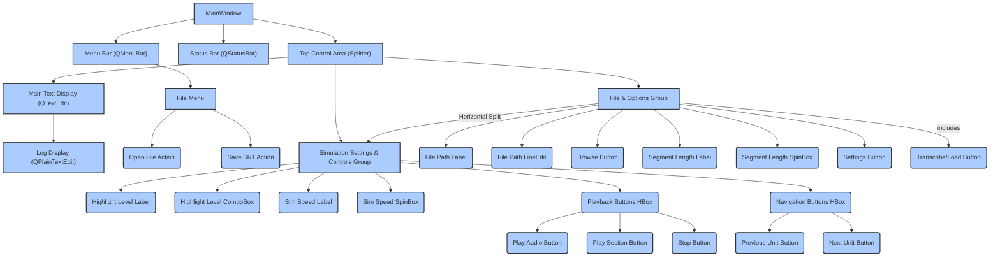

<!-- TINS Specification v1.0 -->
<!-- ZS:PROJECT:Parakeet_GUI -->
<!-- ZS:LANGUAGE:Python -->
<!-- ZS:FRAMEWORK:PySide6 -->
<!-- ZS:LLM_MODEL:Any capable of Python code generation, focus on clarity -->

# Parakeet_GUI

## Description

A desktop application designed for transcribing audio files into text using NVIDIA's Parakeet Automatic Speech Recognition (ASR) model (`nvidia/parakeet-tdt-0.6b-v2`), which requires a CUDA-enabled GPU. The application processes audio in configurable chunks and displays the transcribed text in a user interface. A key feature is the simulation of text highlighting (at sentence, word, or character level) synchronized with a simulated timeline, aiding in review and timing analysis. The application supports loading previously transcribed `.srt` files for quick viewing and simulation, bypassing transcription. It also allows saving the current transcription to a standard `.srt` file. It provides robust error handling to assist users in identifying and resolving prerequisite issues like missing FFmpeg or CUDA/NeMo configuration problems.

## Functionality

### Core Features

1.  **Audio Transcription (`model.py`):**
    *   Load and process an audio file (handling various formats via `pydub` which requires FFmpeg).
    *   Segment large audio files into manageable chunks for processing.
    *   Use the `nemo_toolkit[asr]` `nvidia/parakeet-tdt-0.6b-v2` model to transcribe audio segments.
    *   Obtain precise word-level timestamps from the ASR model output (`timestamps=True`).
    *   Combine transcription text and word timestamps from all segments, accurately adjusting timestamps to be relative to the start of the original audio file.
    *   Structure the final timed text data into a format consumable by the GUI (see Data Structures below).
2.  **Timed Text Loading (`model.py`):**
    *   Given an audio file path, automatically attempt to find and load a corresponding `.srt` file in the same directory with the same base name (e.g., `audio.mp3` -> `audio.srt`).
    *   If found and successfully parsed, load the text and segment-level timestamps from the `.srt` file. Attempt to parse word-level timing if present within the SRT (e.g., using HTML `<font>` tags), otherwise estimate word timing based on segment duration.
    *   **Note:** If transcription is subsequently performed for the associated audio file, the more accurate word timing from the ASR model output takes precedence over any estimated or parsed SRT word timing.
3.  **Save Transcription to SRT (`model.py` & `main.py`):**
    *   Allow the user to save the currently loaded structured timed text data (obtained either via transcription or SRT load) to a standard SubRip (`.srt`) file.
    *   The saved SRT file should include standard SRT block formatting (index, timestamp, text).
    *   Sentence timestamps in the SRT should correspond to the sentence start/end times in the structured data.
    *   If word-level timing is available (from ASR or parsed SRT), the generated SRT should ideally include word-level timing information using a format parsable by the loader (e.g., `<font>` tags).
4.  **Text Display (`main.py`):**
    *   Display the full transcribed or loaded text in a large, read-only, scrollable text area (`QTextEdit`).
    *   Support scrolling to the currently highlighted segment.
5.  **Playback & Simulation (`main.py`):**
    *   Synchronize highlighting with either actual audio playback time (if an audio file is loaded) or a timer-based simulation timeline.
    *   Dynamically highlight the current text unit (sentence, word, or character) in the display area based on the current timeline position and the timed text data.
6.  **Highlighting Levels (`main.py`):**
    *   Allow the user to select the granularity of highlighting: Sentence, Word (default), or Character. This selection determines the size of the unit highlighted and navigated.
7.  **Playback/Simulation Controls (`main.py`):**
    *   Provide buttons: `Play Audio`, `Play Section`, `Stop`, `Previous Unit`, `Next Unit`.
    *   Buttons should be appropriately enabled/disabled based on the application state (e.g., `Play Audio` requires a loaded audio file; all playback/navigation controls require timed text data).
    *   `Play Audio`: Start/continue actual audio playback using `PySide6.QtMultimedia`. Highlighting syncs with the audio position. Starts from the beginning or the time corresponding to the currently selected/highlighted unit.
    *   `Play Section`: Start/continue the text highlighting simulation based on a `QTimer`, independent of actual audio playback speed. Simulation time progresses according to the `Sim Speed Multiplier`. Starts from the time corresponding to the currently selected/highlighted unit.
    *   `Stop`: Stop both audio playback (`PySide6.QtMultimedia`) and the text highlighting simulation timer, and clear the current highlight.
8.  **Simulation Speed Control (`main.py`):**
    *   Allow the user to adjust the speed of the timer-based text highlighting simulation using a `QDoubleSpinBox` or `QSlider` (e.g., 0.5x to 3.0x).
9.  **Manual Navigation (`main.py`):**
    *   Provide "Previous Unit" and "Next Unit" buttons to jump backward or forward by one timed text unit (based on the selected highlighting level). This updates the highlighted text and the associated time for subsequent playback/simulation.
    *   Clicking within the text display should jump the timeline and highlight to the unit containing the clicked position.
10. **Error Reporting (`main.py` & `model.py`):**
    *   Implement robust error handling within `model.py` for dependency issues (FFmpeg, NeMo, CUDA), audio processing failures, transcription errors, and SRT parsing problems, raising specific exceptions.
    *   `main.py` must catch these exceptions and present clear, user-friendly error messages to the user via `QMessageBox.critical` for show-stopping issues (like missing dependencies) or status bar/log area for process errors.
    *   Provide a detailed log area for technical diagnostics and traceback information.

## User Interface (`main.py`)

*   **Base Framework:** PySide6 version >= 6.9.0.
*   **Style & Theme:** Default to 'Fusion' style and 'Auto' color scheme. Provide a "Settings..." dialog to allow users to select from available `QStyleFactory.keys()` and choose 'Auto', 'Light', or 'Dark' color schemes. Settings should persist (e.g., using `QSettings`).
*   **Main Window:** A standard `QMainWindow`.
*   **Layout:** Use a `QSplitter` (e.g., vertical) to separate the control area, the main text display, and the log area. The control area itself might use a horizontal splitter or nested layouts to group controls.
    *   **Control Area (Top):** Contains `QGroupBox` widgets for logical grouping.
        *   "File & Options" Group: Labels, `QLineEdit` (read-only) for file path, "Browse..." `QPushButton`, `QLabel` and `QSpinBox` for segment length, "Settings..." `QPushButton`.
        *   "Simulation & Playback" Group: `QLabel` and `QComboBox` for Highlight Level (`"Sentence"`, `"Word"`, `"Character"`), `QLabel` and `QDoubleSpinBox` for Sim Speed Multiplier, `QHBoxLayout` for playback control buttons ("Play Audio", "Play Section", "Stop") and navigation buttons ("Previous Unit", "Next Unit"). Include a "Transcribe / Load File" button in one of these groups (perhaps "File & Options").
    *   **Main Text Display Area (Middle):** A `QTextEdit` for the transcript. It should be vertically and horizontally scrollable. Read-only. Supports character-level formatting for highlighting using `QTextCursor` and `QTextCharFormat`. Supports click-to-jump navigation.
    *   **Log Display Area (Bottom):** A read-only `QPlainTextEdit` or `QTextEdit` to show application logs, warnings, and errors. Should be resizable via the splitter.
    *   **Status Bar:** A `QStatusBar` at the bottom for transient status messages.
*   **Menu Bar (Recommended):** A simple `QMenuBar` with a "File" menu containing "Open File..." and "Save SRT..." actions. "Open File..." should trigger the file browsing logic. "Save SRT..." should be enabled only when data is loaded.
*   **Widget Types:** Use standard `PySide6.QtWidgets` like `QLabel`, `QLineEdit`, `QPushButton`, `QSpinBox`, `QDoubleSpinBox`, `QComboBox`, `QGroupBox`, `QSplitter`, `QTextEdit`, `QPlainTextEdit`, `QMainWindow`, `QStatusBar`, `QMenuBar`, `QAction`, `QDialog`, `QFormLayout`, `QDialogButtonBox`, etc. Use `PySide6.QtGui` for `QTextCursor`, `QTextCharFormat`, `QColor`, `QFont`, etc. Use `PySide6.QtCore` for `Qt`, `Slot`, `QSize`, `QSettings`, `QFile`, `QTextStream`, `QDateTime`, `QTimer`, `QUrl`, `QPoint`. Use `PySide6.QtMultimedia` for audio playback (`QMediaPlayer`, `QAudioOutput`).
*   **Text Highlighting:** Implement highlight application and removal efficiently using `QTextCursor.setPosition`, `QTextCursor.movePosition(KeepAnchor)`, and `QTextCursor.mergeCharFormat`. Store the previously highlighted range to clear it quickly.

## Technical Implementation

*   **Architecture:** Strict Model-View separation.
    *   `model.py`: Pure Python module containing all data processing logic: audio handling (`pydub`), NeMo interaction, transcription, timestamp processing, data structuring, SRT parsing and generation. *Must not* import `PySide6` or any GUI libraries. Methods should process data or raise exceptions, returning structured Python objects.
    *   `main.py`: The GUI application. Handles UI creation, user input, signal/slot connections, state management (enabled/disabled controls, current unit index), text highlighting presentation, audio playback (`PySide6.QtMultimedia`), timer-based simulation (`QTimer`), and calls methods in `model.py` for backend processing, handling exceptions raised by `model.py`.
*   **Data Structures (`model.py`):** The structured timed text data passed from `model.py` to `main.py` and used for saving to SRT should follow this format:
    ```python
    # Structure used by main.py and generated/consumed by model.py
    [
        {
            'text': 'Full sentence text.', # Sentence text (cleaned)
            'start_time': float, # Sentence start time in seconds (float)
            'end_time': float,   # Sentence end time in seconds (float)
            'words': [ # List of word objects within this sentence
                {'text': 'word1', 'start_time': float, 'end_time': float}, # Word text
                {'text': 'word2', 'start_time': float, 'end_time': float}, # Word start/end times in seconds
                # ... more words
            ]
        },
        # ... more sentences
    ]
    ```
    Character timing information is derived dynamically by `main.py` from word timings and character positions for the 'Character' highlight level.
*   **Algorithms:**
    *   Audio loading, resampling, channel conversion, segmentation (`pydub`).
    *   NeMo ASR processing, timestamp extraction (word-level).
    *   Timestamp adjustment based on segment offsets.
    *   Heuristic sentence boundary detection.
    *   SRT file parsing (index, time, text block) and optional word tag parsing/timing estimation.
    *   SRT file generation from structured data, including formatting times and potentially adding word tags.
    *   Mapping timed units (sentences, words, chars) from the data structure to precise character index ranges within the `QTextEdit`'s plain text content (`main.py`).
    *   Playback simulation timing loop (`main.py` `QTimer`).
    *   Audio playback control and position tracking (`PySide6.QtMultimedia`).
    *   Finding the correct timed unit based on current time or cursor position.
*   **Dependencies:**
    *   Python 3.12 or higher.
    *   `PySide6>=6.9.0` (including `PySide6.QtMultimedia` module)
    *   `pydub`
    *   `nemo_toolkit[asr]`
    *   `torch` (specifically the CUDA-enabled version compatible with your GPU and CUDA version). Specify index-url for nightly if needed, e.g. `torch --index-url https://download.pytorch.org/whl/nightly/cu121`
    *   `cuda-python>=12.9.0` (or compatible version with your CUDA toolkit)
    *   **External:** `ffmpeg` executable must be installed and available in the system's PATH. The application should verify its presence.

### Error Handling & Validation

*   **Dependency Checking (`main.py`):** At startup and potentially when triggering processing, `main.py` should call `model.py` functions that implicitly or explicitly check for `ffmpeg` (via subprocess or pydub errors), `torch` (CUDA availability), `nemo_toolkit`, and `pydub`. Display critical `QMessageBox` errors if essential dependencies are missing or fail to initialize (e.g., CUDA not found).
*   **Error Signaling (`model.py`):** `model.py` methods must raise specific, informative exceptions for errors encountered (e.g., `FileNotFoundError`, `FFmpegNotFoundError`, `InvalidAudioFileError`, `NemoInitializationError`, `TranscriptionError`, `SRTParseError`).
*   **Error Presentation (`main.py`):**
    *   **Critical Setup Errors:** Display in modal `QMessageBox.critical` dialogs that block until acknowledged.
    *   **Processing Errors:** Catch exceptions from `model.py` during transcription/loading/saving and report them clearly in a `QMessageBox` or the dedicated log area.
    *   **Status/Warnings:** Use the `QStatusBar` for brief operational status messages ("Ready", "Loading model...", "Transcribing...", "Saving SRT...", "Playback stopped."). Use the log area for more detailed warnings and non-critical issues.
    *   **Detailed Log:** Use the separate log `QPlainTextEdit` to display a history of actions, warnings, and captured exception tracebacks from `model.py` or within `main.py`'s processing loops, enabling easier troubleshooting.
*   **File I/O:** Handle potential exceptions during file operations (opening, reading, writing) for audio, SRT, or temporary files.
*   **Input Validation:** Validate user-provided settings like segment length (> 0).

### Technical Constraints & Notes

*   Requires a CUDA-enabled GPU with sufficient VRAM for the Parakeet model (`nvidia/parakeet-tdt-0.6b-v2` is a relatively large model) and compatible drivers.
*   FFmpeg is an essential external dependency for `pydub` to handle diverse audio formats.
*   The `model.py` component *must* be runnable standalone with a command-line interface that accepts a `--test [number]` argument to verify core logic independent of the GUI.
*   Application performance is highly dependent on the speed of the CUDA-enabled GPU and the efficiency of the audio processing and model.
*   Memory usage can be significant, particularly when loading the ASR model and processing long audio files. Segmentation helps mitigate this.
*   Highlighting simulation speed (`Play Section`) is independent of actual audio playback speed (`Play Audio`).
*   SRT loading attempts basic parsing including `<font>` tags for word timing, but ASR word timing is generally more accurate and is used if transcription is performed.

### Acceptance Criteria

Acceptance criteria will primarily focus on the test suite within `model.py` and basic GUI behavior demonstrating interaction with `model.py`.

1.  The `model.py` script can be executed directly from the command line using `python model.py --test [number]`.
2.  Running `python model.py --test 1` successfully performs basic environment checks (e.g., FFmpeg presence via subprocess call, attempting dependency imports like `torch`, `nemo`, `pydub`, and checking CUDA availability). It should output success/failure messages for these checks.
3.  Running `python model.py --test 2` successfully loads and processes a bundled or predefined test audio file into temporary segments, returning total duration and segment timings, without unhandled exceptions. This verifies `pydub` and basic audio processing.
4.  Running `python model.py --test 3` successfully transcribes a bundled or predefined test audio file using the NeMo model, obtains word timestamps, and returns structured timed text data in the specified format, demonstrating the core ASR and data structuring logic works independently of the GUI. The output structure should contain sentences with nested timed words.
5.  Running `python model.py --test 4` successfully loads and parses a bundled or predefined test `.srt` file (including one with simple `<font>` word timing tags), returning structured timed text data in a format consistent with transcription output (sentences with nested timed words/estimations), without unhandled exceptions.
6.  (Implied GUI Acceptance - for manual user testing): On a system with all prerequisites installed and configured (FFmpeg in PATH, CUDA-enabled GPU, correct `torch`/`cuda-python`/`nemo` installation):
    *   The GUI launches successfully and displays the main window with controls.
    *   Dependency checks are performed and reported in the status bar/log. Critical dependency errors (like missing CUDA) are shown in a message box.
    *   The user can browse and select an audio file. The file path is displayed.
    *   Clicking "Transcribe / Load File" correctly triggers either SRT loading (if an SRT exists) or audio transcription (`model.py`).
    *   If transcription is performed, the transcribed text appears in the main text display. If an SRT is loaded, the SRT text appears.
    *   Playback/simulation/navigation controls are enabled after data is loaded.
    *   Clicking "Play Audio" (if audio loaded) starts playback and synchronizes highlighting. Clicking "Play Section" starts timer-based highlighting simulation. Clicking "Stop" stops both.
    *   Highlighting correctly follows the selected level (Sentence, Word, Character).
    *   Simulation speed control affects the `Play Section` timer speed.
    *   "Previous Unit" and "Next Unit" buttons navigate correctly and update highlighting.
    *   Clicking within the text display jumps the highlight and timeline/playback position to the clicked unit.
    *   The "Save SRT..." option in the File menu is available when data is loaded and successfully saves the current timed data to an `.srt` file with correct formatting.
    *   The "Settings..." dialog allows changing style and color scheme, which are applied and persisted.

### Visual Aids

*   The conceptual main window layout is:

